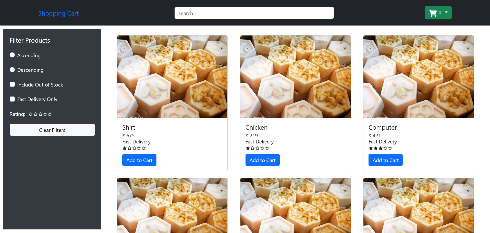

# Shopping Cart With Filters

## Screenshot

## Tech Stack

### Frontend Technologies
- HTML
- CSS
- JavaScript
- ReactJS
- Bootstrap (for styling)
- React-icons (for icons)

### State Management

- React Context API
- useReducer hook

### Data Management

- Faker.js package (for generating fake data)

### Version Control
- Git & GitHub

## Features

### Browsing Features
- Explore a wide range of products effortlessly.
- Sort products in ascending or descending order.
- Filter products by availability (including out-of-stock items).
- Easily find fast delivery options.
- Refine your choices by star ratings.
- Clear all filters with a single click.
- Efficiently search for products using a user-friendly search bar.
  
### Cart Features
- Access a dedicated cart page to review and manage your selections.
- Seamlessly delete items from your cart.
- Conveniently update product quantities.
- Initiate the checkout process for payment.
  

You can checkout the live version of app [here](https://kap-shopping-cart.netlify.app/)

You can reach out to me on linkedin, this is my  [LinkedIn](https://kap-shopping-cart.netlify.app/) profile.

NOTE : Please feel free to provide feedback on my work.